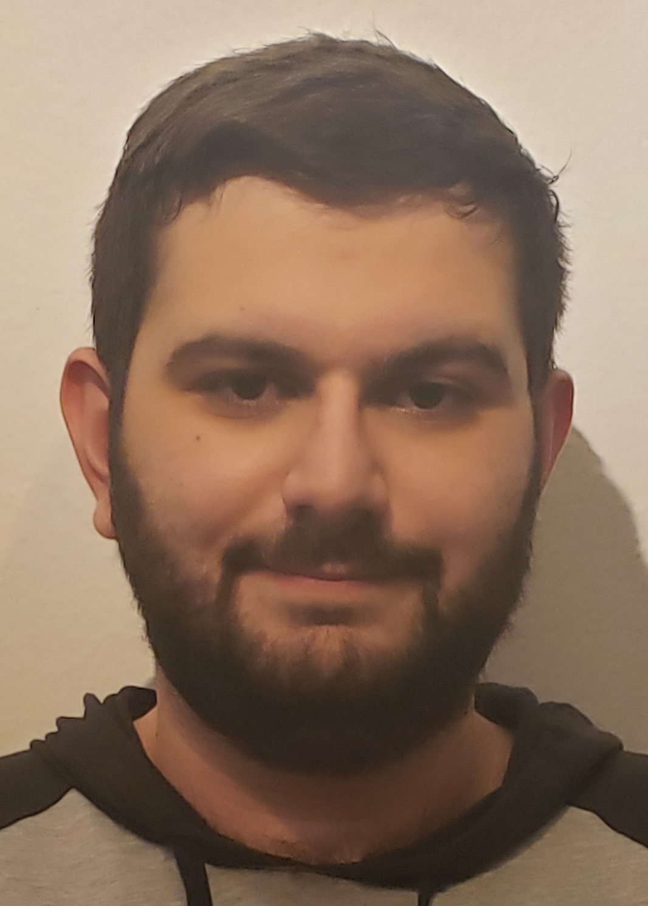

# About Me

- [About Me](#about-me)
  - [Background](#background)
  - [Personal Life](#personal-life)
  - [Career Life](#career-life)

## Background
My name is Ludvig Allen Basmajyan. I was born on July 5, 2000 and raised in Pasadena, California. Back home, I live with my parents as well as my younger sister. My parents immigrated to the United States from Armenia with their brothers, sisters, and cousins. Most of my family now resides in California, making us all first-generation Armenian Americans here in the US. In my family, I am also a first-generation college student, attending UCSD and working towards a degree in Computer Engineering.   

## Personal Life
Growing up, I can say that I *was* a gullible child and always believed **everything** someone would have said, even if I just met them. This lasted for a good while into middle school, but my parents always warned me about this, until I finally got the hint, unfortunately when I was starting to interact with people that fit the untrustworthy role. I still remember what my mom has told me, which was saying in Armenian that roughly translates to the following,

> If somebody cuts your arm, you can forgive them but now you have no way to hug them. 

Besides being guillible in my younger years, I also was always fascinated with finding out how anything is made and how it works, this ranges from huge items to small common household items, such as but not limited to...
- Buildings
- Furniture
- Machines
- Computers
- Websites

These interests just boiled up as I would eventually do research on my own as a little kid about how to fix something or would start building furniture at a young age. This still extends to this day as I now do all the minor repairs around the house so I know how everything operates and then can help fix them either faster or longer in the future. Until that point though, I had no clue what to focus on as a career until I attended high school.

## Career Life
I decided that I wanted to be a programmer back in high school, where we had a program called [App Academy](https://pasedfoundation.org/our-work/in-the-classroom/app-academy/), which is a 4 year program where we learned to code. Through this program, I was able to learn various languages (`Java`, `HTML`, `CSS`, `Javascript`, `C#`, etc) and some repository websites, like `Github` and `BitBucket`. It was at this point that I found out that I loved to do programming and development, as it helped me understand how websites worked and aligned with what I was interested in when I was growing up. The 4 year program was composed of these four main topics, which was covered respectively from 9th - 12th grade.
1. Web Development I
2. Web Development II
3. Mobile Development
4. Senior Capstone

During this time, I also did some internships in high school, and even did some more after graduation for a couple of local business back in my hometown as well as a small project in web dev with some of my family members. While I did do some stuff, I still have a long way to go in terms of being a developer and I have my own set of tasks in front of me, some of which are...
- [X] Internships
- [ ] Degree
- [ ] Job
- [ ] Provide For My Family

That's all about me up until this point of my life. I look forward to working with everyone!